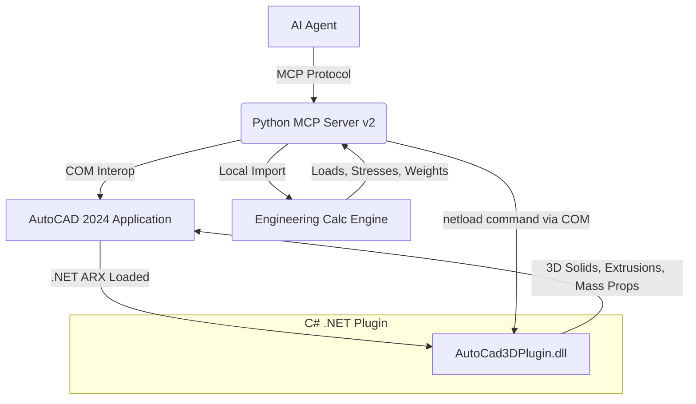

# 09 - V2 Upgrade Architecture: Hybrid Python-C# for 3D & Analytics

## Objective
Upgrade the AutoCAD automation system from a pure 2D COM-based script layer to a hybrid Architecture that combines Python's flexibility (via MCP) with C#'s raw performance and advanced 3D capabilities in AutoCAD (ObjectARX / .NET API).

## V2 Architecture Diagram

## New Components
1. **Engineering Calc Engine (`scripts/calc_engine.py`)**: A purely mathematical/engineering module calculating anchor pull-out limits, material weight, and bending stress on the bracket.
2. **AutoCad3DPlugin (C#)**: A compiled DLL loaded into AutoCAD using the `NETLOAD` command. It exposes commands like `DRAW3DBRACKET` which execute hundreds of times faster than COM loops, and handles complex 3D boolean operations.
3. **MCP Server v2**: Exposes new tools to the AI: `acad_netload`, `acad_run_command` (to trigger C# functions), and `acad_calculate_bracket_stress`.
